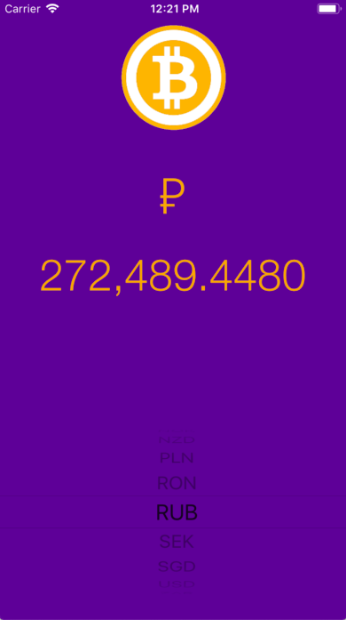

# BitcoinTicker

londonappbrewery challenge

The app will give you the latest Bitcoin prices in all the popular, traded currencies, so you can track how well your Bitcoin investments are doing on the go.
The objective of this challenge is to apply the skills I learned in the Clima tutorial and make a Bitcoin price reporter. This challenge shows how to use Cocoapods, networking calls and JSON parsing.

